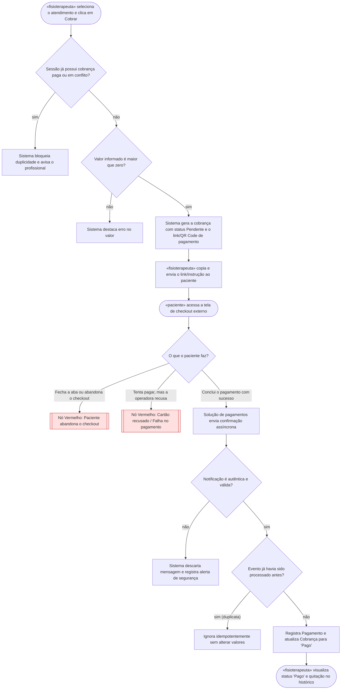

# 🗺️ Jornadas de Usuário

**Projeto:** Auri Motion  
**Versão:** 1.0.0 · jornada inicial via `/utf-flows`  
**Última atualização:** 2026-09-09  

> 🤖 **Este documento é a fonte da verdade sobre O QUE A PESSOA VIVE na tela** —
> o caminho do primeiro clique até o objetivo, e principalmente os pontos onde ela
> trava, espera ou desiste.
>
> 🚫 **Não duplique:** regra de negócio mora no `prd.md`; estado, entidade e contrato
> moram no `architecture.md`. Aqui mora o caminho.

---

## Jornada 1 — Emissão e Confirmação de Cobrança do Atendimento

**Story:** US04 e US05  
**Critérios que ela marca:** Sai do site e volta · Depende do tempo · Depende de outra pessoa agir · Pode ser abandonada no meio  

**O que decidimos sobre os nós vermelhos:**

- **Abandono do checkout (X1):** Caso o paciente feche ou abandone a tela de checkout, a cobrança e o link/QR Code permanecem válidos por uma tolerância de 5 minutos, permitindo que o paciente retorne e conclua o pagamento sem necessidade de uma nova emissão. Expirado esse prazo de 5 minutos sem confirmação de pagamento, o status da cobrança é alterado automaticamente para "Expirado", evitando que registros fiquem pendentes indefinidamente.
- **Cartão recusado / Falha no pagamento (X2):** Em caso de recusa pela operadora de pagamentos, o sistema atualiza o status da cobrança para "Falha no Pagamento" e notifica o fisioterapeuta na tela de detalhes da sessão, permitindo que ele cancele o registro ou reemita uma nova cobrança imediatamente.

---

## Dúvidas em aberto

| # | Dúvida | Onde ela precisa ser resolvida |
| --- | --- | --- |
| 1 | Mecanismo exato de expiração após os 5 minutos (job agendado em background, verificação sob demanda no acesso ou expiração nativa configurada no payload da sessão do gateway) | `/utf-architecture` |
